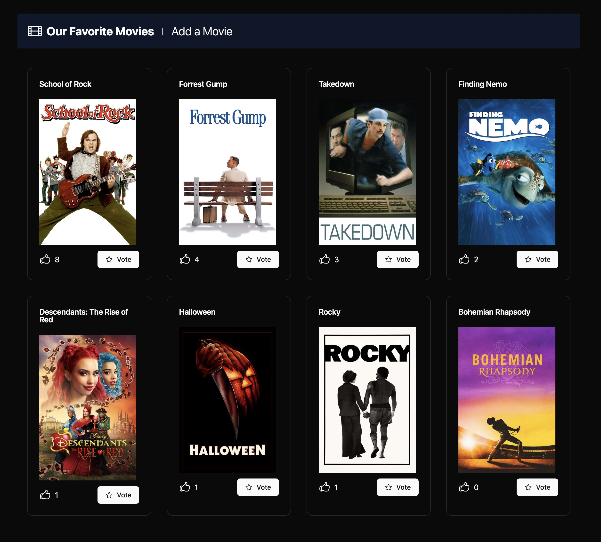

# Our Favorite Movies

This is a simple Nextjs and Payload CMS project.



## Environment Variables

Before running the project, make sure to create a `.env` file in the root directory of the project with the following variables:

DATABASE_URI=<your_database_uri>
PAYLOAD_SECRET=<your_payload_secret>
TMDB_API_KEY=<your_tmdb_api_key>

Replace `<your_database_uri>`, `<your_payload_secret>`, and `<your_tmdb_api_key>` with your actual values.

## Running the Project

To run the project, follow these steps:

1. **Install Dependencies**: Make sure you have Node.js installed. Then, run the following command to install the necessary dependencies:

   ```bash
   pnpm install
   ```

2. **Start the Development Server**: After the dependencies are installed, you can start the development server with:

   ```bash
   pnpm run dev
   ```

3. **Access the Application**: Open your browser and go to `http://localhost:3000` to view the application.

4. **Access the CMS**: Open your browser and go to `http://localhost:3000/admin` to access the Payload CMS.

## Additional Information

For more details on the project, please refer to the documentation or the comments in the code.
